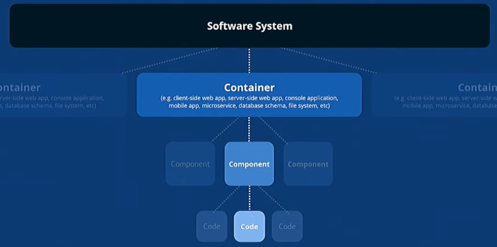
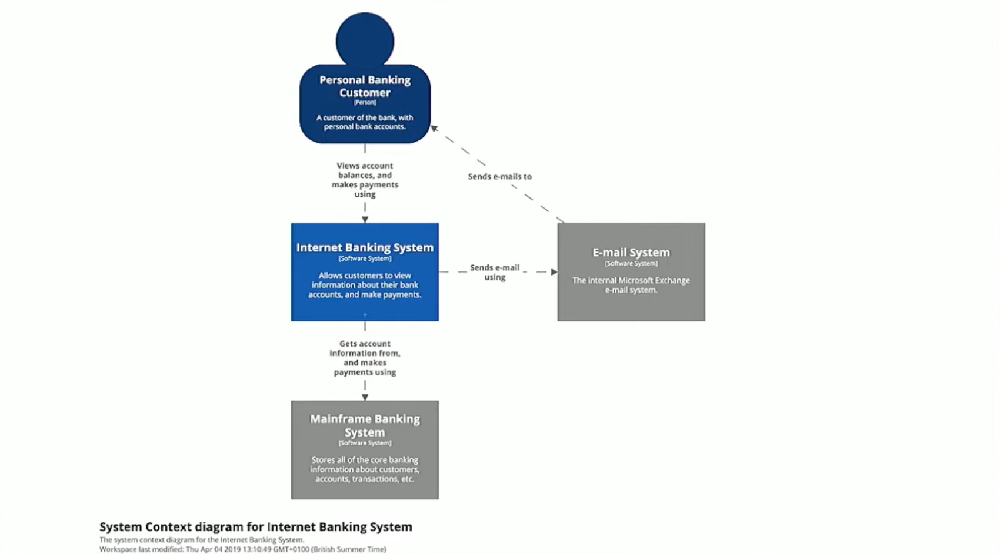
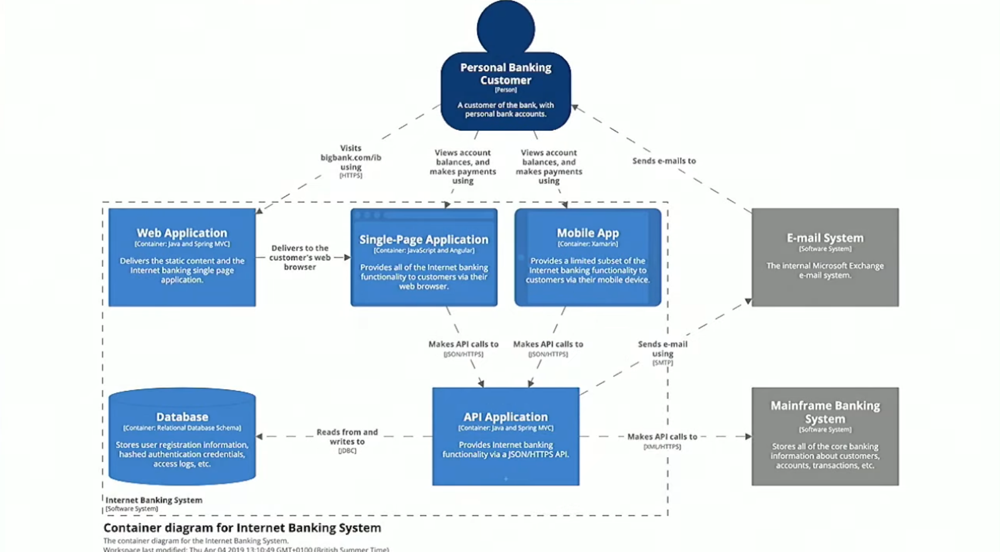
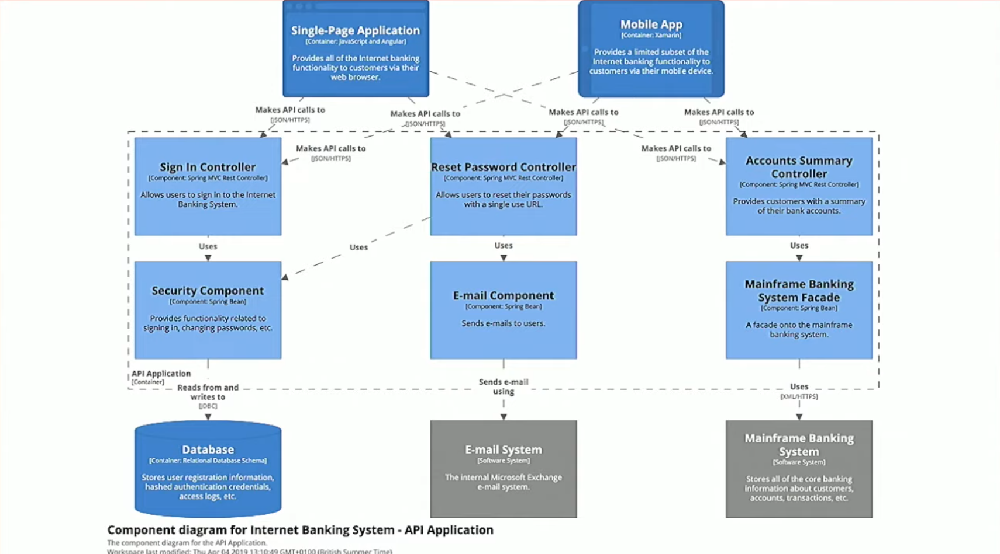
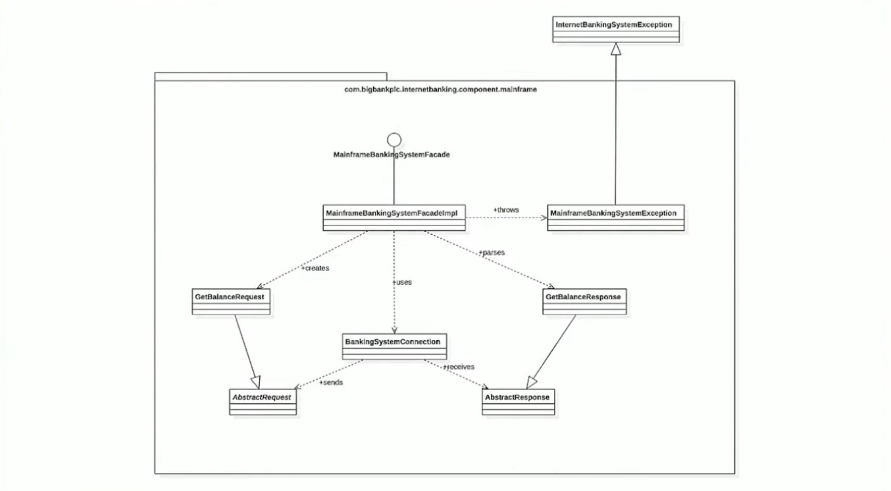

# c4model-notes
High level notes for visualising software architecture (https://c4model.com/).

## UML Difficulties
* Not many people like to use  UML
* Some try to use a "whiteboard" but that doesn't convey much either

## Software architecture diagraming
* When drawing software architecture diagrams, don't think like an architect, think like a software developer
  * Seems counter-intuitive at first
  * Developers can design well but when it comes to showing the architecture, they start thinking a different way
  * 

* The diagram should reflect reality
  * A common set of abstractions is more important than a common notation
  * UML is difficult because the notation is hard to understand for those not familiar with UML already

## C4 Model
* A software system is mode up of one or more containers
  * container = something that runs an app
  * Each of which contains one or more components
    * Components is a grouping of "stuff" running inside a container
    * Which in turn are implemented by one or more code elements
  * 
* C4 Model
  * System context, containers, components, code
  * 4 levels of diagram that help break complexity
* Diagrams are maps that help developers navigate a large, complex codebase
* A model of the static structure forms the basis for other views
  * 

## Implementation - Internet Banking System
* Level 1 - system context diagram
  * Who's using it?
  * Where does information come from?
  * Shows system being worked on and the context around it in terms of people and software systems
  * Purposely leave out tech choices so you can reach a wider audience
  * 
* Level 2 - container diagram
  * Next level shows the system
  * Think back to the C4 Model - not showing details but containers!
  * Showing applications, data stores, technologies it is built with and how they all connect at runtime
  * Each piece inside a container is "mostly" independent while lines between are communication protocols 
  * 
* Level 3 - component diagram
  * Going down to application level
  * Start to think controller and service layer level
  * More common to contain many components at this point
  * This is where low level tech choices are made
  * Looking at this diagram should clearly convey real parts of the code base
  * Architecture starts reflecting code structure at a high level - 1:1 map
  * 
* Level 4 - class diagram
  * Not recommended
  * This is the UML level that folks typically avoid
  * Better to automate it, this is easily changing 
  * 

## Notations
* Titles
  * Put titles on pictures
  * Short and meaningful, include diagram type, numbered if diagram order is important
* Layout
  * Sticky notes and index cards make a great substitute for hand-drawn boxes
* Visual consistency
  * Try to be consistent with notation and element positioning across diagrams
* Acronyms
  * Be wary of using them since other folks don't use at your level of familiarity
  * Focus on domain and business acronyms
* Elements
  * Start with simple boxes first
  * Be explicit with the type of box it is by labelling
  * Rest of text in box should be short meaningful description
* Lines
  * Favor uni-directional lines showing the most important dependencies or data flow, with an annotation to be explicit about the purpose of the line and direction

## Keep in mind
* Summarize the intent of the relationship. Be short but specific
* Beware of hiding the true story
  * Instead of doing something like saying a service sends a message to another service, say why it is doing so
* Key/legend to explain pieces that make up diagram
  * Explain shapes, lines, colours because you will forget when coming back to it later
  * shape, color, size, icons should complement a diagram that already makes sense
* Increase the readability of software architecture diagrams so that they can stand alone
* Any narrative should complement the diagram rather than explain it
* Recommended tooling: C4-PlantUML, Structurizr
* Regardless of tooling think abstractions first, notation second